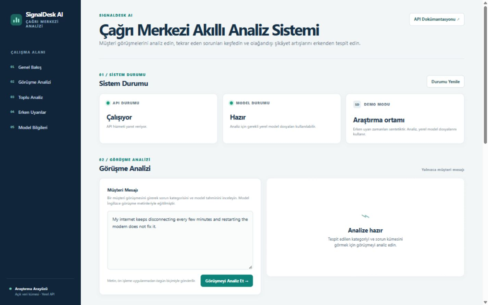

# SignalDesk AI

Çağrı merkezi müşteri metinlerini hizmet alanlarına ayıran, benzer konuları anlamsal kümelerde toplayan ve sentetik zaman verisiyle erken uyarı yaklaşımını gösteren bir AI/ML öğrenme projesidir.



## Depo yapısı

Mevcut Git geçmişi korunarak uygulama kaynakları [`signaldesk-ai/`](signaldesk-ai/) dizininde tutulmaktadır.

- [Ayrıntılı Türkçe README ve kurulum](signaldesk-ai/README.md)
- [Kaynak kod](signaldesk-ai/src/signaldesk/)
- [Web arayüzü](signaldesk-ai/frontend/)
- [Testler](signaldesk-ai/tests/)

## Hızlı başlangıç

Windows PowerShell üzerinde:

```powershell
git clone https://github.com/rna03/signaldesk-ai.git signaldesk-ai-repo
cd .\signaldesk-ai-repo\signaldesk-ai
py -3.11 -m venv .venv
.\.venv\Scripts\Activate.ps1
python -m pip install --upgrade pip
python -m pip install -r requirements.txt
$env:PYTHONPATH = (Resolve-Path .\src).Path
```

Ana model ve demo dosyalarını üretip uygulamayı başlatmak için:

```powershell
python -m signaldesk.ml.train_domain_classifier
python -m signaldesk.clustering.discover_issues_semantic
python -m signaldesk.monitoring.detect_emerging_issues
python -m uvicorn signaldesk.api.main:app --reload
```

Arayüz <http://127.0.0.1:8000/>, Swagger dokümantasyonu <http://127.0.0.1:8000/docs> adresindedir.

> Erken uyarılar sentetik zaman verisine dayanır. Gerçek zamanlı çağrı alımı, ses transkripsiyonu, veritabanı veya canlı alarm gönderimi uygulanmamıştır.
